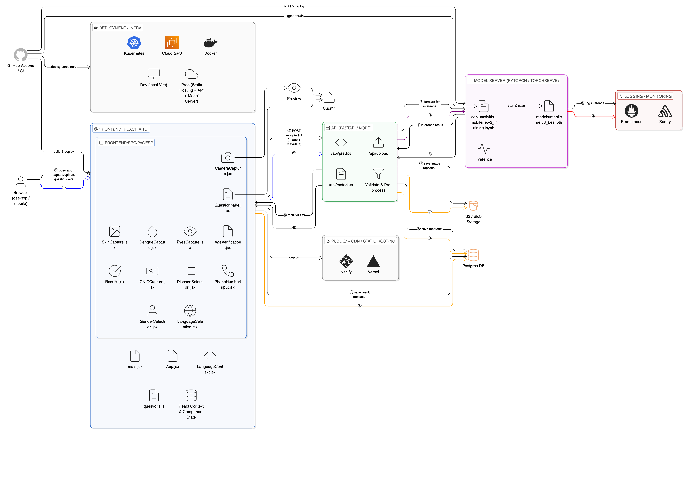

# System Architecture Documentation

## Overview

This document describes the end-to-end architecture of the Disease Detection System, a full-stack application that leverages deep learning models (MobileNetV3) for medical image analysis, specifically for conjunctivitis and other eye disease detection.

## Architecture Diagram

## System Components

### 1. User Layer (Level 0)
- **Mobile Device User**: End users access the system through mobile devices for image capture and diagnosis

### 2. Deployment Infrastructure

The system supports multiple deployment environments:

- **Kubernetes**: Container orchestration for scalable deployments
- **Cloud GPU**: GPU-accelerated compute for model inference
- **Docker**: Containerized application components
- **On-Premises VMs**: Private deployment option
- **Private Cloud/Air-Gapped Server**: Secure, isolated deployment for sensitive medical data

### 3. Frontend Layer (React Application)

#### Core Technologies
- **React.js**: Primary frontend framework
- **Bootstrap**: UI component library
- **React Context**: State management

#### Key Features & Components

**Image Processing & Capture:**
- **MaskCanvas**: Drawing and annotation tools for marking regions of interest
- **DrawingTool**: Interactive canvas for image markup
- **EyeCapture**: Specialized component for capturing eye images
- **AgeGender**: Patient demographic data collection

**Visualization & Analysis:**
- **Heatmap/Viz**: Visual representation of model attention and diagnosis confidence
- **TimeLog**: Session and diagnosis timestamp tracking
- **ChatOrQuery**: User interaction and query interface

**Configuration & Utilities:**
- **GeoBasedOrder**: Location-based service routing
- **LocationCapture**: Geolocation services
- **NewDx**: New diagnosis workflow
- **App.jsx**: Main application entry point
- **LanguageConf.jsx**: Multi-language support configuration

**Data Management:**
- **Bootstrap**: Application initialization
- **React Context & Component Libraries**: Shared state and reusable components

### 4. API Layer (Node.js Backend)

#### Core Responsibilities
- **REST API**: RESTful endpoints for client-server communication
- **Request Routing**: Directs requests to appropriate services
- **Database Integration**: Manages data persistence
- **Authentication & Authorization**: User and session management
- **Model Orchestration**: Coordinates inference requests to ML models

#### Key Endpoints
- Patient data management
- Image upload and preprocessing
- Model inference requests
- Metadata and results retrieval
- External API integration

### 5. Model Serving Layer (PyTorch/ONNX Runtime)

#### Components
- **Inference Engine**: Serves trained MobileNetV3 models
- **Preprocessing Pipeline**:
  - Image normalization
  - Resizing and augmentation
  - Format conversion
- **Patient Data Processing**: Contextual patient information handling
- **Metadata Management**: Model versioning and configuration
- **Validation**: Input data validation before inference

#### Model Architecture
- **Base Model**: MobileNetV3 (optimized for mobile deployment)
- **Task**: Multi-class classification for eye disease detection
- **Runtime**: PyTorch or ONNX Runtime for optimized inference
- **Cross-Validation**: 4-fold models as shown in repository

### 6. External Integrations (Client-A)

#### DERM/OTC External Services
- **Firebase**: Real-time database and authentication
- **Cloud Services**: External cloud provider integrations
- **Third-party APIs**: Additional medical or diagnostic services

### 7. Storage Layer

#### Components
- **Firestore Storage**: Document-based storage for patient records and metadata
- **Images Database**: Dedicated storage for medical images
- **Cloud Storage**: Scalable object storage for large files
- **Backup & Archive**: Data retention and compliance storage

### 8. Monitoring & Analytics

- **PhoneStats**: Mobile device metrics and performance monitoring
- **Netlify**: Frontend deployment and analytics

## Data Flow

1. **User Interaction**:
   - User captures eye image through mobile device
   - React frontend collects patient metadata (age, gender, location)

2. **Image Processing**:
   - Image uploaded to Node.js API
   - Preprocessing pipeline prepares image for model
   - Image stored in Firestore Storage

3. **Model Inference**:
   - API forwards preprocessed image to model serving layer
   - PyTorch/ONNX Runtime executes inference
   - Model returns prediction probabilities and class labels

4. **Results Delivery**:
   - API aggregates model predictions with metadata
   - Results stored in database
   - Heatmap/visualization generated
   - Frontend displays diagnosis to user

5. **Data Persistence**:
   - Patient records stored in Firestore
   - Images archived in dedicated storage
   - Audit logs maintained for compliance

## Deployment Options

### Cloud Deployment
- **Frontend**: Netlify or similar static hosting
- **Backend API**: Node.js on cloud VMs or Kubernetes
- **Model Serving**: GPU-accelerated cloud instances
- **Storage**: Cloud-native storage solutions

### On-Premises Deployment
- **Air-Gapped Server**: Complete isolation for sensitive data
- **Private Cloud**: Internal cloud infrastructure
- **Local Storage**: On-site data storage for compliance

### Hybrid Deployment
- Frontend on CDN
- Backend and models on private infrastructure
- Encrypted communication between layers

## Security Considerations

- **Data Encryption**: End-to-end encryption for patient data
- **Authentication**: Secure user authentication and authorization
- **HIPAA Compliance**: Medical data privacy standards
- **Access Control**: Role-based access to sensitive information
- **Audit Logging**: Complete audit trail for all operations

## Scalability

- **Horizontal Scaling**: Kubernetes-based auto-scaling for API and model serving
- **Load Balancing**: Distribute requests across multiple instances
- **Caching**: Redis or similar for frequently accessed data
- **CDN**: Global content delivery for frontend assets
- **Database Sharding**: Partition data for improved performance

## Technologies Summary

| Layer | Technologies |
|-------|-------------|
| Frontend | React.js, Bootstrap, JavaScript |
| Backend API | Node.js, Express.js |
| Model Serving | PyTorch, ONNX Runtime, MobileNetV3 |
| Database | Firestore, MongoDB (indicated by icon) |
| Storage | Firestore Storage, Cloud Storage |
| Deployment | Docker, Kubernetes, Netlify |
| Infrastructure | Cloud GPU, On-Prem VMs, Private Cloud |
| External Services | Firebase, Cloud Services |

## Model Details

The system uses **MobileNetV3** architecture trained for eye disease detection (specifically conjunctivitis detection based on repository context):

- **Training Strategy**: K-fold cross-validation (4 folds)
- **Model Files**:
  - `mobilenetv3_fold_1.pth`
  - `mobilenetv3_fold_2.pth`
  - `mobilenetv3_fold_3.pth`
  - `mobilenetv3_fold_4.pth`
- **Optimization**: Designed for mobile and edge deployment
- **Inference**: Real-time prediction on mobile-captured images

## Future Enhancements

- Multi-model ensemble for improved accuracy
- Real-time video analysis
- Offline mobile inference
- Advanced visualization and explainability
- Integration with electronic health records (EHR)
- Multi-disease classification expansion
